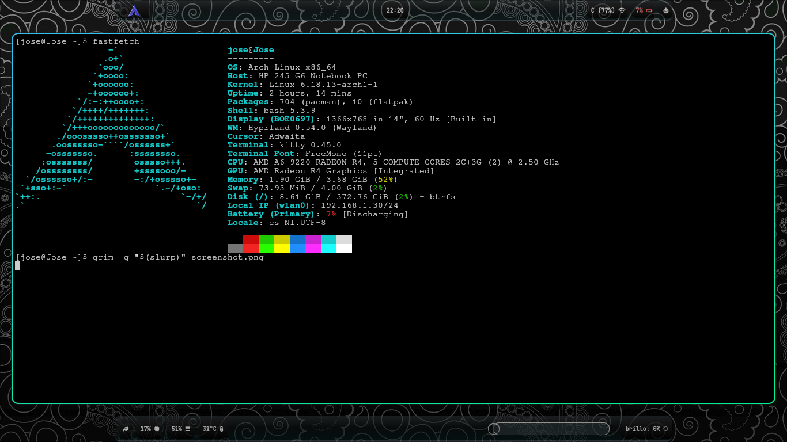

# MyWaybarCustomDotfile
My own waybar dotfile

📦 Dependencies

Install required packages:
```bash
sudo pacman -S wofi wlogout power-profiles-daemon brightnessctl networkmanager
```
Enable required services:
```bash
sudo systemctl enable --now power-profiles-daemon
sudo systemctl enable --now NetworkManager
```
🔤 Recommended Fonts

This configuration uses Nerd Font icons. Make sure you install:
[JetBrains Mono Nerd Font](https://www.jetbrains.com/lp/mono/)
[0xProto Nerd Font](https://www.programmingfonts.org/#oxproto)

🖼 Preview

